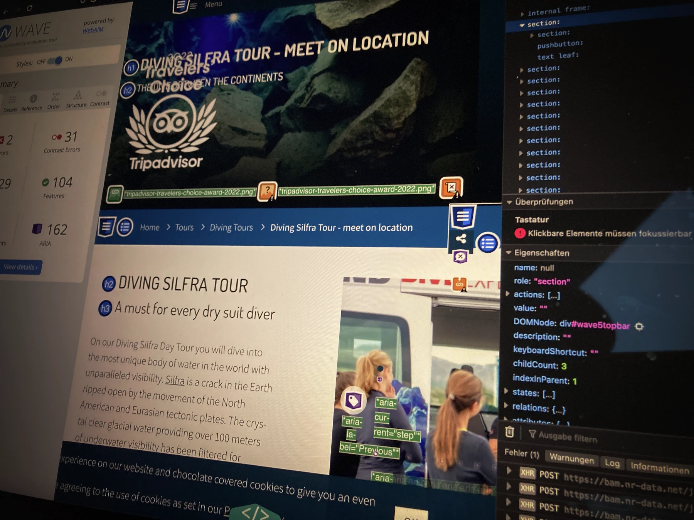
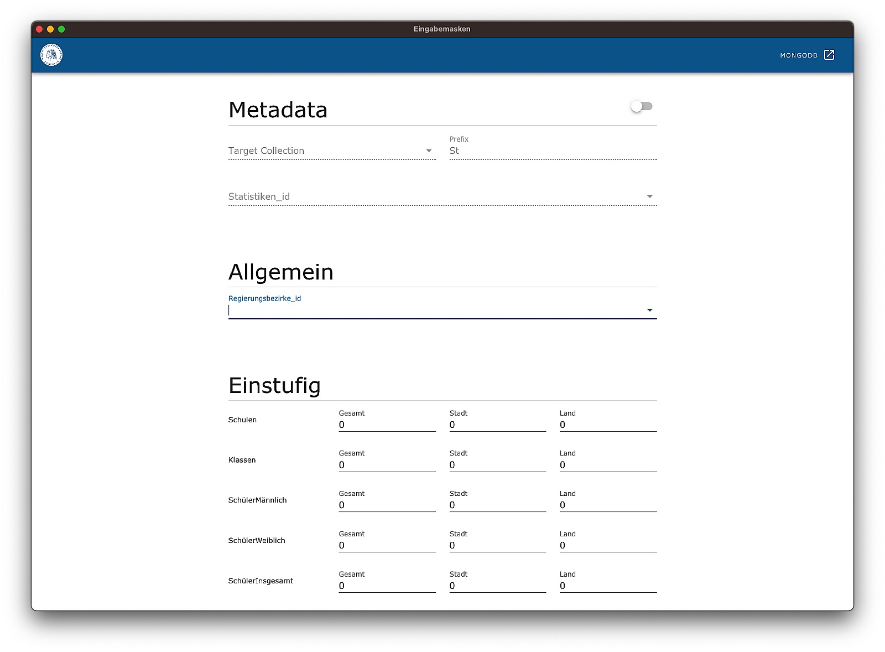

<section id="topic-list">
    <ul class="toc">
        <li><a href="#paragraph_1">Muss ich oder sollte ich?</a></li>
        <li><a href="#paragraph_2">Zugänglichkeit konzipieren</a></li>
        <li><a href="#paragraph_3">Inspektion der Zugänglichkeit</a></li>
        <li><a href="#paragraph_4">Portfolio-Seite für alle</a></li>
        <li><a href="#paragraph_5">Website für alle</a></li>
        <li><a href="#paragraph_6">Webanwendung für alle</a></li>
    </ul>
    

        <h2>Keywords</h2>
        <ul>
            <li>Web Accessibility</li>
            <li>Einfach für Alle</li>
            <li>Zugänglichkeit</li>
            <li>Gebrauchstauglichkeit</li>
            <li>Web Content Accessibility Guidelines</li>
        </ul>
    

</section>

<section id="paragraph_1">
    <h2>Muss ich oder sollte ich? Gesetze, Richtlinien und Verordnungen</h2>
    
    
        
Um Barrieren zu beseitigen und immer mehr Bereiche für alle zugänglich zu machen gibt es einige Gesetze und Richtlinien - auch im Web. Die Barrierefreie-Informationstechnik-Verordnung schreibt vor, dass Websits und Apps von öffentlichen Stellen des Bundes barrierefrei sein müssen. Und das nicht nur in Deutschland - Die BITV stellt nur die Deutsche Umsetzung der Europäischen Richtlinie 2016/2102 dar. Was dabei zur richtigen Umsetzung beachtet werden muss gibt die harmonisierte Norm EN 301549 vor. Diese beruht hierbei auf der den <a href="https://www.w3.org/WAI/standards-guidelines/wcag/">Web Content Accessibility Guidelines</a> des <a href="https://www.w3.org/Consortium/">World Wide Web Consortium</a> welche wiederum Richtlinien aufstellt um das Web barrierearm zu gestalten. Klingt kompliziert? Ist es auch, aber irgendwie auch nicht.

    

</section>

<section id="paragraph_2">
    <h2>Zugänglichkeit konzipieren</h2>
    <figure data-columns="2" class="smaltext">
        
        <figcaption>
            

            
<strong>Wie so oft: vorher schon an nacher denken. Zugänglichkeit ist kein Add-On, dass sich im Nachgang implementieren lässt, sondern eine Entscheidung und integraler Bestandteil der Konzeption. Folgende Bausteine spielen dabei ein wichtige Rolle:</strong>

            
<strong>Inhaltliche Struktur:</strong> Jeder Nutzer profitiert von einer verständlich Website oder Web-App um schnell die Information oder Funktion zu finden die gesucht wird … auch ohne visuelle Darstellung.

            
<strong>Tastaturbedienbarkeit:</strong> Alle Elemente die man anklicken kann sollten auch mit der Tastatur bedienbar sein und es sollte keine Tastaturfallen geben aus denen man nicht wieder rauskommt, wie modale Fenster die sich nicht ohne Maus wieder schließen lassen.

            
<strong>Textalternativen:</strong> Elemente die rein mit Bildern oder Icons beschrieben werden sollten alle eine Alternative in Textform besitzen, den wenn die Bilder oder Icons nicht geladen oder angezeigt werden können gehen wichtige Informationen schnell verloren. Auch die Suchmaschine braucht Alternativtexte für visuelle Inhalte.

            
<strong>Verständlichkeit:</strong> Jeder Nutzer profitiert von klaren und verständlichen Inhalten.

            
<strong>Design:</strong> Farben von Vorder- und Hintergrund sollten so gewählt sein, dass ein ausreichender Kontrast erreicht wird. Schriften sollten gut lesbar sein damit die Inhalte von möglichst allen unter möglichst allen Bedingungen gelesen werden können.

            

        </figcaption>
    </figure>
    <ul class="steps smalltext" data-box-width="l">
        <li>Wir setzen uns mit Dir zusammen, analysieren den Ist-Zustand und entwickeln eine gemeinsame Zielsetzung.</li>
        <li>Wir checken welche Technologie für Deine Anforderungen, Deine Daten und Deinen Geldbeutel am besten passt.</li>
        <li>Wir gehen mit Dir in die Konzeption und klären u.a. diese Fragen: Welche Daten sind relevant? Welche Daten sind welchen Update-Zyklen unterworfen? Wie dynamisch soll die Suche sein? Ist Datenschutz für Dein Projekt ein Thema? Was passiert nach dem Finden?</li>
        <li>Wir coden Deine Anwendung und freuen uns Zwischenstände mit Dir anzuschauen, zu besprechen und zu verbessern.</li>
        <li>Wir supporten Dich  bei der Integration in Deine Infrastruktur und monitoren auf Wunsch den Livebetrieb Deiner Anwendung.</li>
    </ul>
</section>

<section id="paragraph_3">
    <h2>Inspektion der Zugänglichkeit</h2>
    
    
        
Du hast Daten in Deinem CRM, einer Excelliste oder einer anderen Datenquelle und willst selbige Deinen Kunden, einer anderen Anwendung oder der Öffentlichkeit zur Verfügung stellen? Hier hilft eine API. Wir helfen Dir Deine Daten bereit zu stellen, bauen für Dich eine Schnittstelle entlang des weit verbreiteten REST Paradigmas und sichern die Zugriffe ab. 

    

    

        <h3>Leistungen</h3>
        <ul>
            <li>Datenaufbereitung und -aggregation</li>
            <li>Konzeption und Entwicklung der Schnittstelle entlang des <a href="https://de.wikipedia.org/wiki/Representational_State_Transfer">REST Paradigmas</a></li>
            <li>Dokumentation der Schnittstelle via <a hef="https://www.openapis.org">Open API</a></li>
            <li>Monitoring der Schnittstelle</li>
            <li>Implementierung von Zugriffskonzepten für verschiedene Nutzergruppen</li>
            <li>Falls erforderlich: Beratung bei der Auswahl der passenden Lizenz</li>
        </ul>
    

</section>

<section id="paragraph_4">
    <h2>Daten erfassen und pflegen</h2>
    

        
Datenpflege macht keinen großen Spaß. Ja, das stimmt. Und wir wollen auch nicht behaupten, dass die Pflege mit Interfaces und Tools von uns Spaß macht. Das wäre vermutlich etwas übertrieben, denn hier ist es so wie Stromberg schon sagte «Arbeit macht Arbeit, darum heißt sie ja so.». Datenpflege macht Arbeit. Aber mit den richtigen Tools und Interfaces fällt es dann häufig doch etwas leichter, geht schneller und die Datenqualität ist im Endeffekt besser, egal ob es um die Pflege von Produkt-, Kunden- oder Forschungsdaten geht. 
        

    

    <figure data-columns="2" class="smalltext">
        
        <figcaption>
            <ul>
                <li>Sichtung und Analyse des Datenmaterials und der zugehörigen Prozesse: woher kommen die Daten, wohin sollen sie, wie oft ändern sich die Daten, usw.</li>
                <li>Zielsetzung, Datenmodell und ein Pflegekonzept erarbeiten</li>
                <li>Konzeption und Umsetzung des Pflegeprozesses: Systeme einrichten, ggf. Pflegemasken bauen, etc. </li>
                <li>Datenmanagement Software konzipieren und konfigurieren oder entwicklen</li>
                <li>Datenschnittstellen entwicklen</li>
                <li>Integration des Pflegeprozesses/ -tools in die bestehende Infrastruktur</li>
                <li>Erstellung von Schulungsmaterial und Schulung der Beteiligten</li>
                <li>Datenqualität prüfen</li>
            </ul>
        </figcaption>
    </figure>
</section>

<section id="paragraph_4">
    <h2>Daten visualisieren: ein Bild sagt mehr als 1000 Worte.</h2>
    
    
        
Egal ob Diagramm, Graph, Karte oder Dashboard: eine gute Datenvisualisierung hilft immer, komplexe Datensätze zu analysieren, zu verstehen und sie zu kommunizieren. Sie zeigt Muster, Trends und Beziehungen in den Daten und man entdeckt Sachverhalte und Korrelationen, die einem sonst entgangen wären. Sie erleichtert und beschleunigt das Verständnis von Daten und damit auch Entscheidungsprozesse. Yeah!
        

    

    

        <h3>Leistungen</h3>
        <ul>
            <li>Analyse der Daten: Welche Daten liegen vor? Was soll/ kann gezeigt werden? Reichen die Daten dafür aus? Müssen sie ggf. ergänzt oder aggregiert werden?</li>
            <li>Datenaufbereitung: für die Visualisierung müssen die Daten oft aufbereitet und bereinigt werden: Entfernen von ungültigen oder fehlerhaften Daten, Aggregieren von Daten oder das Erstellen von neuen Variablen .</li>
            <li>Gestaltung der Visualisierung</li>
            <li>Integration von Interaktivität: wie sollen die Daten erkundet werden? Gibt es Filter, Zoomen oder andere interaktive Funktionen?</li>
            <li>Pflege und Aktualisierung der Daten</li>
        </ul>
    

</section>

<section id="paragraph_5">
    <h2>Datenschutz & -sicherheit</h2>
    
    
        
Hier hat sich in den letzten Jahren aber mal so richtig was getan. Das Datenschutzrecht hat sich in den letzten Jahren rasant entwickelt. Nach Einführung der europäischen DSGVO (2018) wurde 2021 in Deutschland das Telekommunikation-Telemedien-Datenschutz-Gesetz (TTDSG 2021) verabschiedet. Aus den darin enthaltenen Rechtsnormen ergeben sich weitreichende Pflichten für Website Betreiber:innen hinsichtlich der Verarbeitung personenbezogener Daten. Dazu zählen nicht nur Cookies, sondern so gut wie alles, was sich auf Personen zurückverfolgen lässt. Ein hübsch komplexes Feld und jede Menge Fallstricke und Anforderungen, auf die beim Umgang mit Daten geachtet werden muss.

        
Aber auch der Schutz von Daten und Schnittstellen ist ein riesen Thema. Datenlecks und Angriffe gehören leider zum Alltag und wer möchte schon als <a href="https://haveibeenpwned.com">gehackt</a> gelabelt werden. Niemand.

    

    

        <h3>Leistungen</h3>
        <ul>
            <li>Analyse und Beratung rumd um das Thema Datenschutz</li>
            <li>Unterstützung bei der rechtskonformen Erhebung, Speicherung und Verwaltung von Daten</li>
            <li>Sichtung und Beratung in Sachen Datensicherheit</li>
            <li>Integration von rechtskonformer Cookie Verwaltung Dokumentation</li>
            <li>Analyse und Tests von bestehenden Systemen in Bezug auf Datensicherheit und Zugriffsschutz</li>  
        </ul>
    

</section>

<section class="is-light" id="preise">
    <h2>Preise (<i>aka Hausnummern</i>)  🙀</h2>
    
Bei Festpreisen werden wir immer ein bisschen nervös, denn der resulierende Aufwand hängt letztendlich von einigen Faktoren ab, z.B. Komplexität der Daten, erforderliche Freigabeprozesse, Komplexität der Integration in den Website Kontext, dem Team, der Menge der Daten, der Zugänglichkeit der Datenquellen usw. ab. Trotzdem im Folgenden einige Anhaltspunkte mit wechem Budget sich was machen lässt.

    










    

</section>
---

Das Web ist so konzipiert, dass es für alle Menschen funktioniert und nutzbar ist. Dabei sollten ihre Hardware, Software, Sprache, ihr Standort oder ihre Fähigkeiten keine Rolle in Sachen Nutzbarkeit spielen. Die Auswirkungen von Behinderungen werden durch das Web radikal verändert, denn das Web beseitigt Kommunikations- und Interaktionsbarrieren, mit denen viele Menschen in der physischen Welt konfrontiert sind. Wenn Websites, Anwendungen, Technologien oder Tools jedoch schlecht gestaltet sind, können sie Barrieren schaffen, die Menschen von der Nutzung ausschließen.
