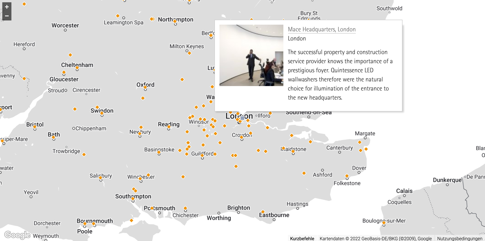
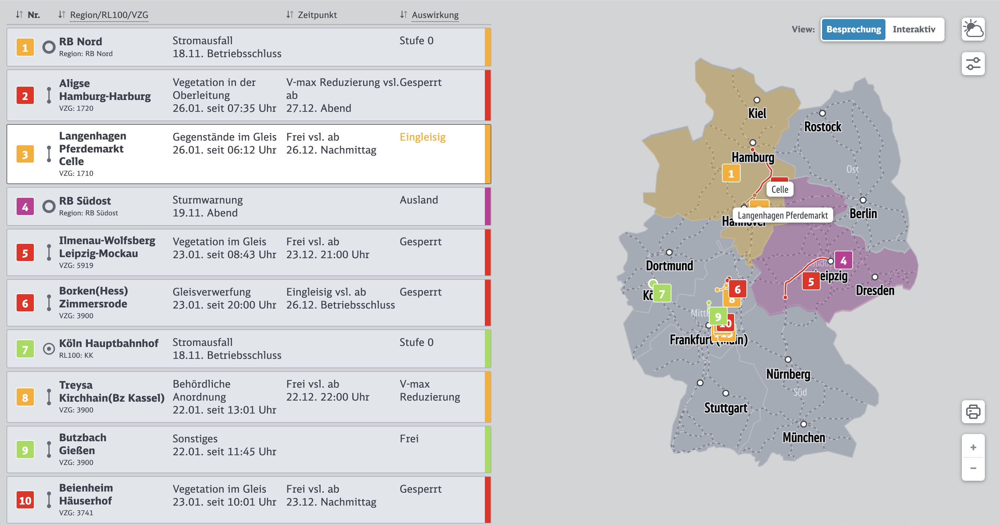

<section id="topiclist">
    <ul>
        <li><a href="#paragraph_1">Datenvisualisierung mit Karten</a></li>
        <li><a href="#paragraph_2">Einfache interaktive Karten mit Kartendiensten</a></li>
        <li><a href="#paragraph_3">Individuelle Kartenlösungen</a></li>
        <li><a href="#paragraph_4">Preise</a></li>
    </ul>
</section>

<section id="paragraph_1">

<h2>Datenvisualiserung mit Karten</h2>

<figure data-columns="2" class="smaltext">
    
    <figcaption>
        

            
Wo gibt es Niederlassungen, Showrooms, Vertragshändler oder Projektstandorte? Wo passiert im Moment was? Wo ist die Fahrzeugflotte gerade?

            
Interaktive Karten sind ein aufregendes Spielfeld des Informationsdesigns und beantworten diese Fragen schnell und für die User intuitiv erfassbar. Wir transformieren Ihre Daten in ansprechende Kartendarstellungen und -Anwendungen.
            

        

    </figcaption>
</figure>

<ul class="steps smalltext" data-box-width="l">
<li>Wir schauen uns gemeinsam die Zielsetzung der Karte und Ihre Datenquellen an.</li>
<li>Wir beraten Sie bei der Wahl der Kartentechnologie.</li>
<li>Gemeinsam erarbeiten wir ein Konzept, welche Points of Interest in die Karte integriert und welche Interaktionen angeboten werden sollen. Wir klären mit Ihnen typische Fragen, wie Straßen oder Regionsbezeichnungen angezeigt werden sollen oder ob der Kartenausschnitt entsprechend des Standorts der User angepasst werden soll. Hier befassen wir uns auch mit der gestalterischen Anpassung des Karten.</li>
<li>Wir unterstützen Sie bei der Integration der Karten in die bestehende Infrastruktur, weisen auf etwaige datenschutzrechtliche Aspekte hin und nehmen bei Bedarf die Karte und die zugehörigen Datenquellen in unser Monitoring auf, um bei Störungen möglichst schnell reagieren zu können.</li>
</ul>

</section>

<section id="paragraph_2">

<h2>Einfache interaktive Karten mit Kartendiensten</h2>

Öffentliche Kartendienste wie Google Maps oder Open Street Map eröffnen ein breites Spektrum an Nutzungsmöglichkeiten auf Basis hervorragendem Datenmaterials.
Schnell und unaufwändig können wir damit z.B. Niederlassungen, Showrooms, Vertragshändler oder Projektstandorte sichtbar machen, aber auch dynamische Daten wie den  Postiotionen von Fahrzeugen oder Ereignissen anzeigen. Dabei kann die Darstelling der Karte auf die besonderen Bedürfnisse Ihrer Anwendung oder Ihres Corporate Designs angepasst werden: Ebenen oder Elemente werden aus- oder eingeblendet. Farben und Fonts individuell angewendet oder Dynamiken eingefügt.

<figure data-columns="2" class="smalltext">
    
    <figcaption>
        <h4>Leistungen</h4>
        <ul>
            <li>Beratung zur Wahl des passenden Kartendienstes</li>
            <li>POI (Points of Interest: Marker, Geometrie) in Karten einzeichen</li>
            <li>Kartenausschnitt aufgrund des Standortes der User anpassen</li>
            <li>Designanpassungen</li>
            <li>Integration des Kartenservices in die bestehende Infrastruktur</li>
            <li>Interaktionsmöglichkeiten (z.B. Anzeige von zusätzlichen Ebenen)</li>
        </ul>
    </figcaption>
</figure>

</section>

<section id="paragraph_3">

<h2>Individuelle Kartenlösungen</h2>

Für einige Anforderungen reichen die Angebote der öffentlichen Kartendienste, wie Google Maps oder Open Street Map, nicht aus.
Für eine inviduelle Darstellungen werden oft Abstaktionsgrade oder Geometrien wie z.B. Streckenzüge, Indoor Architekturen oder Flächenkenzeichnugen benötigt. die
die Kartendienste nicht bieten können. Hier entwickeln wir für Sie Ihre individuelle Kartenlösung: Kartenmaterial wird für Sie erstellt. dynamisch, also datenbasiert, angereichert oder mit bestehendes Material z.B. um Indoorkarten ergänzt. 

<figure data-columns="2" class="smalltext">
    
    <figcaption>
        <ul>
            <li>Umsetzung eines individuelle Kartelayouts.</li>
            <li>Validierung des Kartenmaterials anhand von Algorithmik</li>
            <li>Flexible und anpassbare Darstellung des eigenen Kartenmaterials in Abhängigkeit von Interaktionen</li>
            <li>Dynamische Positionierung von Labels</li>
            <li>Pathfinder - (rerouting, schnellste Route)</li>
            <li>Kombination verschiedener Karten-Ebenen</li>
            <li>Rendering/Export von statischen Kartenausschnitten</li>
            <li>Integration der Kartenlösung in die bestehende Infrastruktur</li>
        </ul>
    </figcaption>
</figure>

</section>
<section class="is-light" id="paragraph_4">

<h2>Preise</h2>







</section>

<section class="is-light">

<h2>Preise // Variante 👻</h2>

Bei Festpreisen werden wir immer ein bisschen nervös, denn der resulierende Aufwand hängt letztendlich von einigen Faktoren ab, z.B. Komplexität von Interaktion und Daten, erforderliche Freigabeprozesse, Komplexität der Integration in den Website Kontext usw. Trotzdem im Folgenden einige Anhaltspunkte mit welchen Preisen in etwa zu rechnen ist.





{% include preispaket-liste.html 
    headingLevel=3
    headline="Selbst generierte Karten mit eigener Algorithmik" 
    text="Sie brauchen dynamische Karten mit eigener Algorithmik, z.B. Indoor Routing oder Wegepläne? Hier werden entweder Karten aus öffentlichen Kartendiensten um eigene Geometrien, z.B. Streckenzügen oder Areale erweitert, oder es werden eigene Karten generiert. Auf diesem, selbst erzeugten Kartenmaterial finden die die Visualisierungen und die Interaktion statt."
    price="ab 8000,- €"
    action-url="asasass" 
    action-text = "Ich bin dabei" %}

</section>
